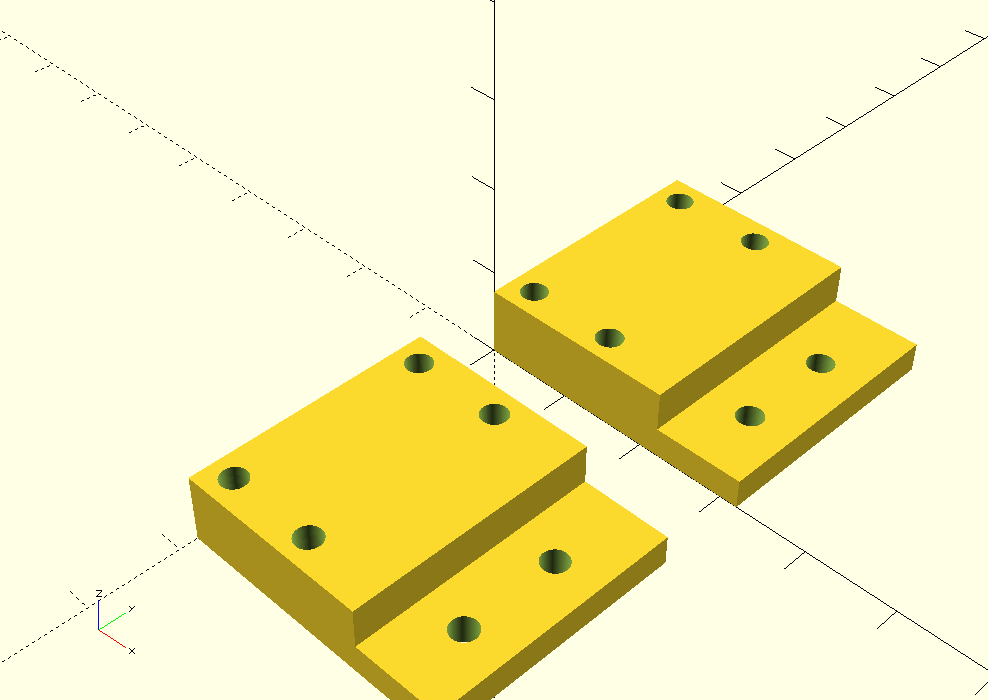

### Overview

Homing switches should make it possible to find 0,0 coordinate in the X-Y plane without manual orientation. Limit switches should provide feedback when the machine tries to move beyond the safe limits of its axes (which could damage the machine). In all cases, these should be binary on/off switches with as little bounce or travel between on and off as possible. The ubiquitous rocker switch seems like a reasonable, if not incredibly precise, place to start this work. The benefit of rocker switches is that nearly anything that will work with a rocker switch will also work with some other kind of switch (except the details of the brackets).

### Notes

* cheap rocker switches should do the trick
  * not clear what accuracy they provide though
* Motor plates are a good place to mount switches for X and Y
  * Wiring from here should be simple, since it can follow existing paths
  * Needs a mounting bracket that fits into the slot on the side of the plate
  * Bracket can be cut for threading by the machine screw if printed (the material is soft enough)...no nut required

### Selections / Solutions

* [Custom limit switch bracket (SCAD)](cad/limit-switch-brackets.scad) [(STL)](cad/limit-switch-brackets.stl) - created by John and Zack
  * 15mm M3 machine screw is a slightly too small to mount through the rocker switch (you get about two threads' worth of bite in the bracket at best)
  * 15mm screw is a little too tall for mounting the bracket onto the motor plate
     * using two M3 2.4mm thick nuts as spacers here works beautifully
  * No nuts required for fastening to the bracket; M3 machine screw will cut its own threads through the material

* [Cheap rocker switches](http://www.amazon.com/gp/product/B00H8TIEHW/ref=oh_aui_detailpage_o00_s00?ie=UTF8&psc=1)
  * M3 machine screws fit the mounting holes perfectly, but leftover 15mm screws from Shapeoko 2 build are slightly too short.

### Potential Solutions for Z Axis

#### Materials

* [Post-assembly T-slot nuts](https://www.inventables.com/technologies/post-assembly-t-slot-nuts) for makerslide

#### Prints

* [Rear-mounted, right-angle bracket](https://www.thingiverse.com/thing:408063)

### Wiring / Configuration Instructions

* [Shapeoko site's doc](http://www.shapeoko.com/wiki/index.php/Home/Limit_Switches)
* [Connecting to grbl](https://github.com/grbl/grbl/wiki/Connecting-Grbl)